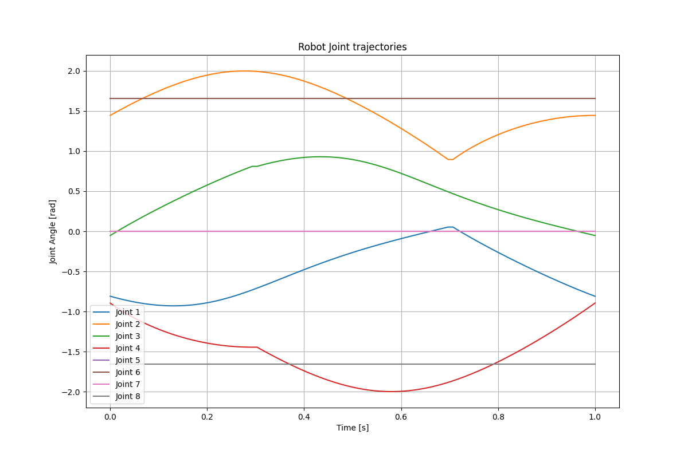

# Introduction

This is where the code lies for both the manual and reinforcement learning scripts. First, this code is very rough and was first pass, riddled with a pleothra of bad coind practices. However, this is not production code and is meant to showcase ideas.


## Manual Walking

The two scripts for the manual walking is done in files `ellipsoid_traj_small.py` and `ellipsoid_traj_long.py`

In these scripts is where the math to generate the ellipsoid and then using the forward and inverse kinematics of the legs turn the ellisoid x and y trajectory to joint coordinates for the legs.

The output of the script is done in function 

```
def sim_to_real_text_file(trajectory, num_steps):

```

This outputs a csv and a text file in the format needed to upload to arduino for the joint trajectories that will need to be followed in the Arduino code.


 

 


## Running the training

The reinforcement learning pipeline to generate trajectories to put on the robot was running `robot_train.py`, `robot_evaluate.py`, and then `robot_csv_simulation.py`. Also, the `robot_env.py`

### robot_env.py

The create of the enviornment is one of the biggest steps of the pipeline. Some things are probably easiest to adjust are the, action space limits as this controls the minimum and max value of the leg positions

```
action_low  = np.array([ -75,  30,  0, -120, 0,  70, 0, -110]) * np.pi/180
action_high = np.array([   0, 120, 75,  -30, 0,  110, 0,-70]) * np.pi/180
```

Also adjusting the rewards

```
reward = (self._distance_weight * forward_reward 
                  - self._energy_weight * energy_reward 
                  + self._drift_weight * drift_reward 
                  + self._shake_weight * shake_reward
                  + fall_penalty #Penalty for falling
                  )
```

### robot_train.py

To train the robot I used Proximal Policy Optimization (PPO) incorporated through [stable_baseline3](https://stable-baselines3.readthedocs.io/en/master/modules/ppo.html). This script pretty simple it starts the enviornment and run the training for the total amount of time_steps you set. Values to change would be:


```
learning_rate
n_steps
batch_size
total_timesteps

name of the output model
```

The output of this script will be `ppo_robot.py` that holds information about the train model that can be played back in new environemnt instance

### robot_evaluate.py

In robot_evaluate I run the model that I got in robot_train.py, for a few num_steps. The goal here is to get the robot walking for it has a decent walking gait that we can extrapolate later in `robot_csv_simulation.py`. The output of `robot_evaluate.py` is a csv of the joint trajectories of the robot during the model playback.

### read_csv_simulation.py

The `robot_csv_simulation.py` is the last step in my RL pipeline, and it is my hacky way to get the robot trajectories after doing the reinforcement learning. This scripts reads the robot_evaluate.csv produced from `robot_evaluate.py`, and you modify the 

```
start_timestep = 
end_timestep = 
```

Then the script output the trajectories at this time as a text file that can be placed in Arduino .ino file.


